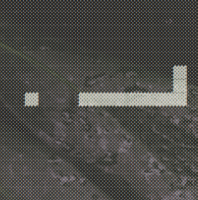

# 100-Line Snake

An implementation of [Snake](<https://en.wikipedia.org/wiki/Snake_(video_game_genre)>), in less than 100 lines of Node.js.

## Installation

1.  Clone the repo and `cd` into the directory.
2.  Run `npm start` to start the game. (No need to run `npm install` -- every line is native Node.)
3.  Use the arrow keys to rotate the snake. Eat food and avoid eating yourself!
